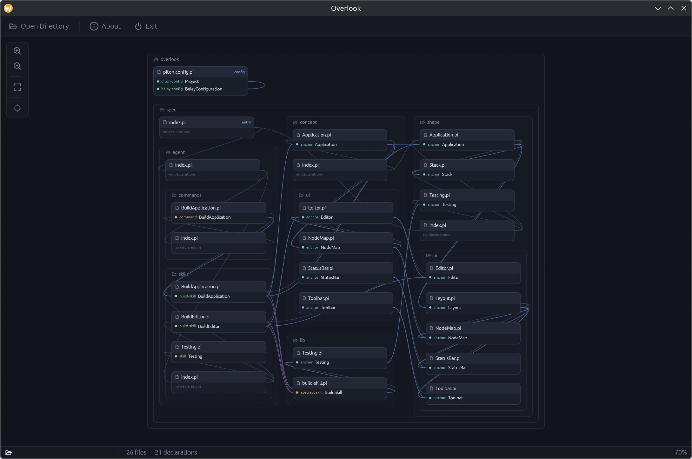

# Overlook

An application for exploring [Piton](https://github.com/piton-lang/piton-rs) specifications.

Open a directory containing a `piton.config.pi` and Overlook draws the whole
specbase as an infinite canvas of nodes — one per file, grouped by folder, with
lines drawn between the anchors and symbols that reference one another.
Selecting a node opens the file in a sidebar editor with Piton syntax
highlighting and language-server diagnostics.



## Requirements

- [Rust](https://rustup.rs) (2021 edition toolchain)
- A desktop environment — Overlook is a native GUI app built on `egui`, and runs
  on Windows, macOS and Linux (Wayland and X11)
- The `piton` CLI on your `PATH`, if you want the editor's language-server
  features. Overlook starts it as `piton lsp --stdio`; without it the map and
  editor still work, and the status bar reports the server as unavailable.

On Linux you will also need the usual native windowing libraries, e.g. on
Debian/Ubuntu:

```sh
sudo apt install build-essential pkg-config libxkbcommon-dev \
    libx11-dev libxcursor-dev libxrandr-dev libxi-dev libwayland-dev
```

The **Open Directory** dialog goes through the XDG desktop portal, so a portal
backend (`xdg-desktop-portal-gtk`, `-kde`, `-hyprland`, …) needs to be installed
for it to appear.

## Clone and run

```sh
git clone git@github.com:piton-lang/overlook.git
cd overlook
cargo run --release
```

Then click **Open Directory** and pick a folder containing a `piton.config.pi`.

You can also point Overlook straight at a project on the command line:

```sh
cargo run --release -- /path/to/your/piton/project
```

Overlook's own `spec/` directory is a Piton project, so opening the repo you
just cloned gives you the picture above.

To build a binary without running it:

```sh
cargo build --release   # target/release/overlook
```

## Using it

**Node map**

- Drag the canvas to pan, or drag with the middle button from anywhere,
  including from a node
- Scroll to zoom; drag a node to move it
- Click a node to select it
- Double click a node to focus on it and its connections; `Escape`, or a double
  click on the background, leaves focus

**Editor**

- Selecting a node opens its file in the sidebar, coloured by the Piton grammar
- **Save** writes the changes back, **Cancel** throws them away, and the close
  button lets the node go
- The language server marks what it finds wrong at the foot of the sidebar, and
  says what a word is when the pointer rests on it
- Drag the edge between the map and the sidebar to say how the two share the room

## Tests

```sh
cargo test
```

The test harness drives the real UI without opening a window, and puts a scripted
language server and directory picker in place of the live ones.
